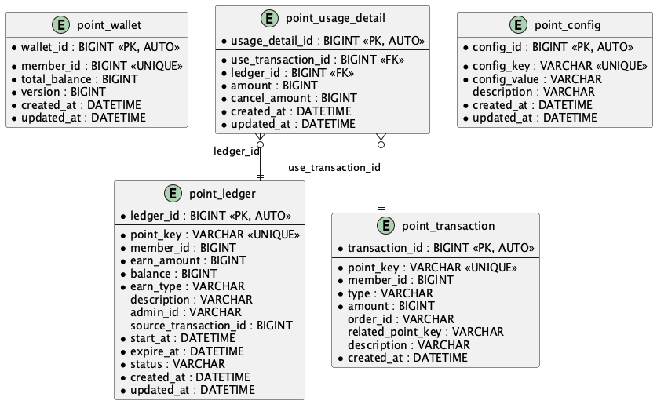

# 무료 포인트 시스템 API

무료 포인트의 적립/적립취소/사용/사용취소를 관리하는 REST API 서버입니다.

## 기술 스택

| 항목 | 기술 |
|---|---|
| Language | Java 21 |
| Framework | Spring Boot 3.4.x |
| Database | H2 (In-Memory) |
| Build Tool | Gradle 8.11 (Kotlin DSL) |
| ORM | Spring Data JPA |
| API 문서 | Spring REST Docs + Asciidoctor |
| 테스트 | JUnit 5 + Mockito + MockMvc |

## 빌드 및 실행

### 사전 요구사항
- Java 21 이상
- Docker / Docker Compose

### 개발환경 셋팅
```bash
docker compose up -d    # Redis 실행 (localhost:6379)
```
```bash
docker compose down      # 종료
```

### 전체 빌드
```bash
./gradlew build
```

### 모듈별 빌드
```bash
./gradlew :point-core:build    # 공통 도메인/서비스
./gradlew :point-api:build     # API 서버
./gradlew :point-batch:build   # 배치
```

### 실행
```bash
./gradlew :point-api:bootRun     # API 서버 실행
./gradlew :point-batch:bootRun   # 배치 서버 실행
```

### 테스트
```bash
./gradlew test                   # 전체 테스트
./gradlew :point-api:test        # API 테스트만
./gradlew :point-core:test       # Core 테스트만
```

### API 문서 생성 및 확인
```bash
# bootRun으로 실행 시 (자동으로 문서 생성 포함)
./gradlew :point-api:bootRun

# IntelliJ에서 main() 직접 실행 시 (최초 1회 수동 실행 필요)
./gradlew :point-api:copyDocsToResources    # test → asciidoctor → copyDocsToResources
```

서버 실행 후 아래 URL 접속:
- API 문서: http://localhost:8080/docs/index.html
- H2 Console: http://localhost:8080/h2-console (JDBC URL: `jdbc:h2:mem:pointdb`)

## ERD



### 테이블 설명

| 테이블 | 역할                         |
|---|----------------------------|
| `wallet` | 회원별 포인트 잔액 집계              |
| `ledger` | 적립 원장 (적립 단위, balance 추적)  |
| `transaction` | 포인트 변동 이력 (불변, INSERT-only) |
| `usage_detail` | 사용 시 적립건별 차감 매핑 (1원 단위 추적) |
| `config` | 시스템 설정값 관리                 |

## AWS 아키텍처


## API 목록

| Method | Endpoint | 기능 |
|---|---|---|
| POST | `/api/v1/points/earn` | 포인트 적립 |
| DELETE | `/api/v1/points/earn/{pointKey}` | 적립 취소 |
| POST | `/api/v1/points/use` | 포인트 사용 |
| POST | `/api/v1/points/use-cancel` | 사용 취소 (전체/부분) |
| GET | `/api/v1/points/balance/{memberId}` | 잔액 조회 |
| GET | `/api/v1/points/transactions/{memberId}` | 이력 조회 (페이징) |
| GET | `/api/v1/points/ledgers/{memberId}` | 적립건 목록 (페이징) |
| GET | `/api/v1/points/usage-details/{orderId}` | 주문별 사용 상세 |
| GET | `/api/v1/points/configs` | 설정 조회 |
| PUT | `/api/v1/points/configs/{configKey}` | 설정 변경 |

## 핵심 비즈니스 로직

### 사용 시 차감 순서
1. **관리자 수기지급(ADMIN_MANUAL)** 우선 차감
2. **만료일 짧은 순** (expire_at ASC)
3. PESSIMISTIC_WRITE 락으로 동시성 보호

### 사용취소 복원 로직
- 원본 사용 상세(usage_detail)를 **FIFO 순서**로 처리
- **미만료 적립건**: balance 직접 복원
- **만료된 적립건**: `USE_CANCEL_RESTORE` 타입 신규 적립건 생성
- `cancel_amount` 컬럼으로 부분취소 추적

### 검증 시나리오
```
1. 1000원 적립(A) → 잔액 1000
2. 500원 적립(B)  → 잔액 1500
3. 주문A1234에서 1200원 사용(C) → A에서 1000, B에서 200 차감 → 잔액 300
4. A 만료
5. C에서 1100원 사용취소(D) → A(만료) 1000원은 신규적립(E), B(미만료) 100원 복원 → 잔액 1400
```

## 배치 (point-batch)

### pointExpireJob — 포인트 만료 처리

만료 시점이 지난 ACTIVE 적립건을 만료 처리하는 Spring Batch Job입니다.

#### 처리 흐름

```
Reader → Processor → Writer (chunk size: 100)
```

| 단계 | 동작 |
|---|---|
| **Reader** | `SELECT l FROM Ledger l WHERE status = 'ACTIVE' AND expireAt <= now AND balance > 0` (JPA 페이징) |
| **Processor** | balance가 0인 건 필터링 (방어 로직) |
| **Writer** | 적립건 만료 처리 (`ledger.expire()`) + wallet 잔액 차감 |

#### 실행 방법

```bash
./gradlew :point-batch:bootRun --args='--spring.batch.job.name=pointExpireJob'
```

- 운영 환경에서는 외부 스케줄러로 실행


## 설정값 (config)

| Key | 기본값 | 설명 |
|---|---|---|
| MAX_EARN_AMOUNT_PER_ONCE | 100,000 | 1회 최대 적립 금액 |
| MAX_BALANCE_PER_MEMBER | 5,000,000 | 최대 보유 한도 |
| DEFAULT_EXPIRE_DAYS | 365 | 기본 만료일수 |
| MIN_EXPIRE_DAYS | 1 | 최소 만료일수 |
| MAX_EXPIRE_DAYS | 1,824 | 최대 만료일수 (5년 미만) |
| USE_CANCEL_RESTORE_EXPIRE_DAYS | 365 | 사용취소 신규적립 만료일수 |

## 멱등성 처리

AOP 기반 `@Idempotent` 어노테이션으로 멱등성을 보장합니다. Redis 캐시 → DB fallback → 비즈니스 실행 3단계로 동작합니다.


## 프로젝트 구조

```
point-api/
├── annotation/                          # 커스텀 어노테이션
│   ├── @Idempotent                      # 멱등성 처리 선언
│   └── @IdempotencyKey                  # 멱등키 파라미터 마킹
├── component/                           # 인프라 컴포넌트
│   ├── IdempotencyAspect                # 멱등성 AOP (Redis → DB → 실행 → 캐싱)
│   ├── IdempotencyManager               # Redis 캐시 조회/저장, DB fallback
│   ├── EarnResponseResolver             # 적립 응답 복원 (Transaction → Ledger → EarnResponse)
│   └── TransactionResponseResolver      # 거래 응답 복원 (Transaction → TransactionResponse)
├── config/                              # JPA, Redis 설정
├── controller/                          # REST Controller 4개
│   ├── EarnController, UseController, QueryController, ConfigController
│   └── payload/request/, payload/response/  # record 기반 DTO
├── exception/                           # 글로벌 예외 핸들러
└── service/                             # Facade 서비스
    ├── EarnFacadeService                # 적립 파사드
    └── UseFacadeService                 # 사용 파사드

point-core/
├── domain/                              # JPA Entity
│   ├── Wallet, Ledger, Transaction, UsageDetail, Config
│   └── BaseTimeEntity
├── domain/enums/                        # EarnType, TransactionType, LedgerStatus
├── repository/                          # JpaRepository 5개
├── service/                             # 비즈니스 로직
│   ├── EarnService                      # 적립/적립취소
│   ├── UseService                       # 사용/사용취소
│   ├── QueryService                     # 조회
│   ├── ConfigService                    # 설정 관리 (캐시)
│   └── ExpireService                    # 만료 처리
├── validator/                           # 검증 로직
│   └── EarnValidator                    # 적립 검증 (금액, 날짜, 한도)
└── exception/                           # ErrorCode, ErrorResponse, Exception

point-batch/
├── BatchApplication                     # Spring Boot 진입점
└── job/
    └── ExpireJobConfig                  # 만료 배치 Job (pointExpireJob)
```

## 설계 결정

| 결정                               | 이유                                                  |
|----------------------------------|-----------------------------------------------------|
| 멱등성 AOP 어노테이션, 파사드패턴             | 비지니스 트랜잭션 로직과 분리, 복잡한 로직 앞단에서 멱등성 보장 로직 구현 (관심사 분리) |
| wallet 잔액 집계 테이블                 | 유저별 잔액, 낙관적 락으로 동시성 보호                              |
| usage_detail 브릿지 테이블             | 사용취소 시 개별 복원 근거, 다대다 매핑                             |
| transaction 불변 이력                | 감사 추적(audit trail), INSERT-only                     |
| Long 타입 금액                       | 1원 단위, 소수점 없으므로 BigDecimal 불필요                      |
| 만료 적립건 → USE_CANCEL_RESTORE 신규적립 | 만료 포인트 부활 불가, 별도 적립건으로 추적 가능                        |
